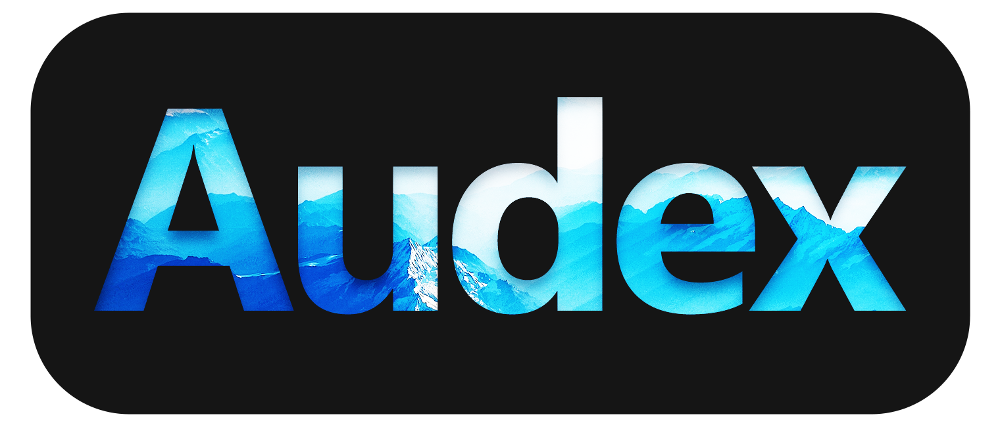

    

    A file storage server with features inspired by Apple's ecosystem.

# Introduction

This project is a work-in-progress. Check back later.

# Table of Contents

To be done.

## Features

To be done.

## Running the Project

To be done.

## Developing and Contributing

To modify this project, follow these steps to get this project working:

1. Clone the repository and cd into repo folder.
2. `cd ./Audex.Desktop` to switch to the Desktop folder
3. `yarn` to install dependencies
4. `npm install -g foreman` to install foreman globally
5. `yarn start` to start the Electron dev server

## Attributions

To be done.
