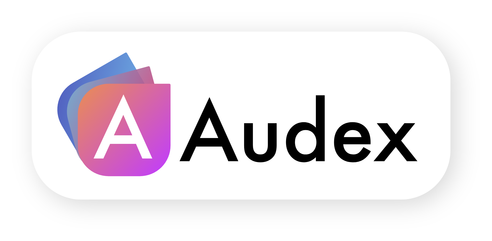
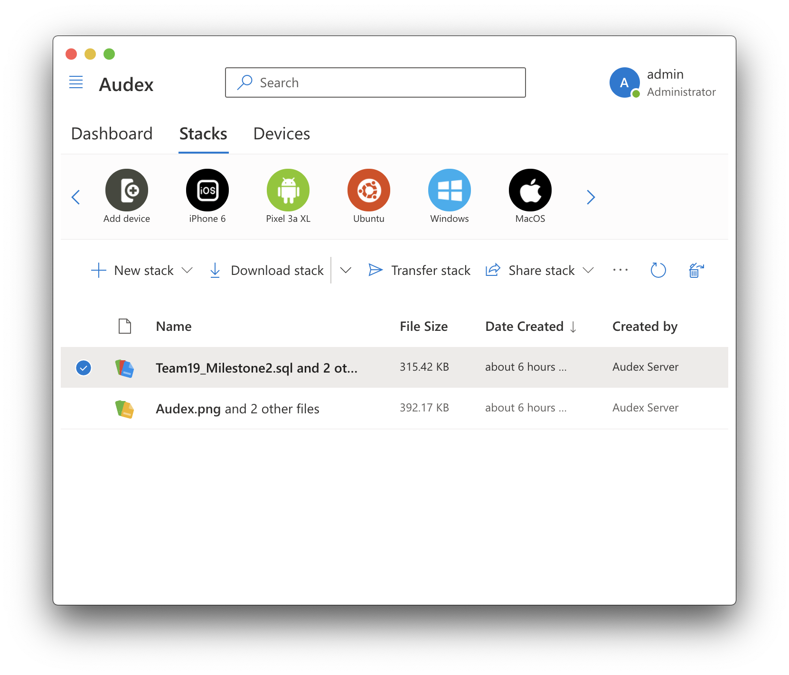

<div align="center">
    
    

    A file storage server with features inspired by Apple's ecosystem.
</div>

# Introduction

This project is a work-in-progress. Check back later.

# Table of Contents

To be done.

## Features

To be done.

## Dev Quick Start
Clone the repository and run the following commands in the root directory:
```bash
docker-compose up -d # Starts MySQL database
yarn api # Starts Audex Server (in watch mode)
yarn desktop # Starts Electron Client (in watch mode)
```
> I'll usually split the terminal right in VSCode and run each command on each side.
> 
> -Marcus

## Projects

This repository contains several different projects. Below are links to each projects README.md for further instructions.

- [Audex.API (.NET Core File Server)](./Audex.API/README.md)
- [Audex.Desktop (Multi-platform React Electron Client)](./Audex.Desktop/README.md)
- [Audex.iOS (Native iOS Client App)](./Audex.iOS/README.md)
- [Audex.Android (Native Android Client App)](./Audex.Android/README.md)

## Attributions

To be done.

## License

To be done.


